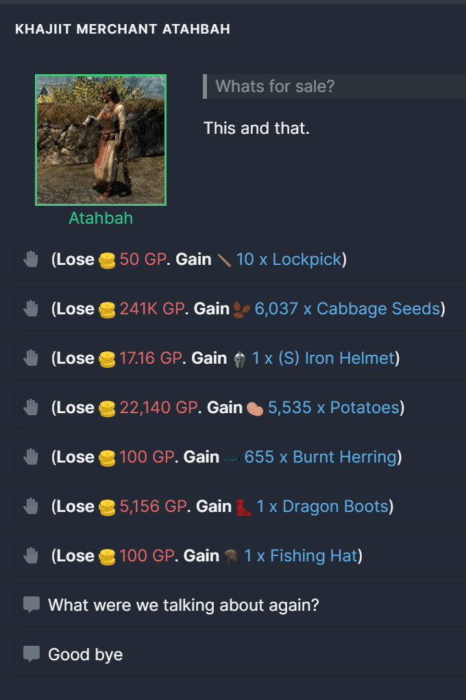

Translations for all languages supported by melvor idle have been provided with this mod, however, I only speak English & Japanese and cannot guarantee the accuracy of translations.

All translations were generated using chat gpt.

If you see an incorrect or missing translation, please create an issue on github providing the correct translation. Thank you!

https://github.com/ottotsuma/Melvor-TES

New slayer areas
New Dungeons
New combat areas
New items
New monsters
New thieving areas
New Shops
New Spells & Curses
Speaking Khajiit merchants (Their items are randomised, just let me know if you see some game-breaking item they are selling)

Khajiit merchants require: dbox If you do not have this mod installed the merchants will not appear but you can play the rest of the mod.

The Bards College will not require any mods, however: Myth Music would make sense and add new items and modifiers to The Elder Scrolls Bards College. dbox will add a shopkeeper to the Bards College and Quest line.  Custom Modifiers in Melvor will add more modifiers to the items.
Monsters will not require any mods to gain categories (Dragon, Human, Undead) from Custom Modifiers in Melvor if you have it installed also.
Ongoing but Classes & Species will add TES specific species into the skill called profile
Not a synergy but comes up a lot. https://mod.io/g/melvoridle/m/show-skill-modifiers Can let you see the item synergies in TES because I believe the base game has no way to view them.
