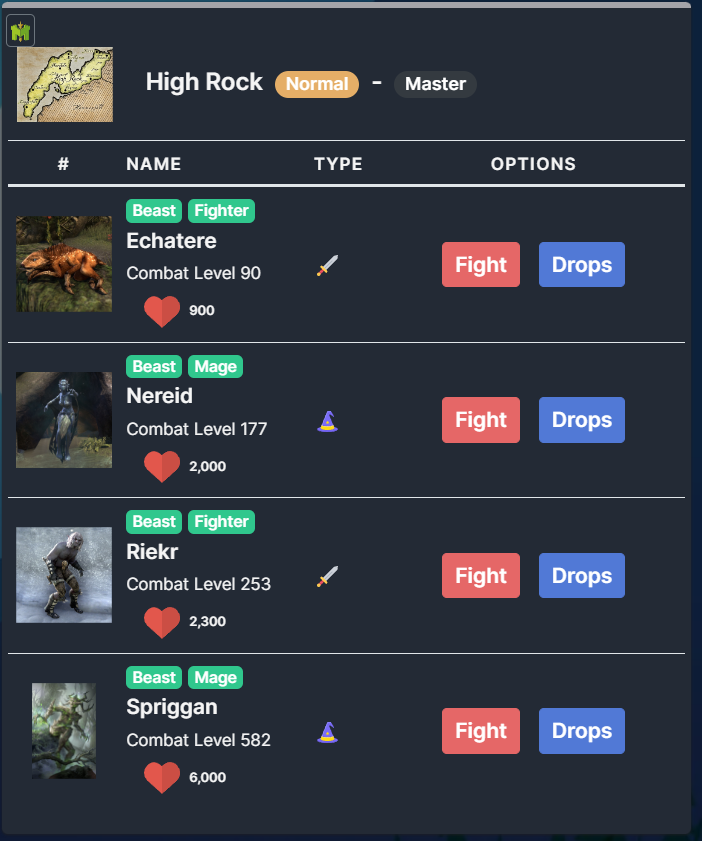

Translations for all languages supported by melvor idle have been provided with this mod, however, I only speak English & Japanese and cannot guarantee the accuracy of translations.

All translations were generated using chat gpt.

If you see an incorrect or missing translation, please create an issue on github providing the correct translation. Thank you!

https://github.com/ottotsuma/Melvor-TES
https://mod.io/g/melvoridle/m/tes

This mod has added so far:

New slayer areas

New Dungeons

New combat areas

New items

New monsters

New thieving areas

New Shops

New Spells & Curses
[wizard](images/wizard.png)
Speaking Khajiit merchants

The Bards College

Monsters will gain categories (Dragon, Human, Undead) from Custom Modifiers in Melvor if you have it installed also.

Intergration with my other mod classes & species, where you can chose one of each for yourself: https://mod.io/g/melvoridle/m/show-skill-Modifiers

